# 🔄 MLOps 파이프라인 전체 흐름도
## 데이터부터 배포까지 한눈에 보기

> **목적**: MLOps 전체 흐름을 시각적으로 이해  
> **핵심**: 데이터 → 학습 → 배포 → 피드백 루프  
> **작성일**: 2026.02.06

---

## 📋 목차

1. [전체 개요도](#1-전체-개요도)
2. [상세 단계별 흐름](#2-상세-단계별-흐름)
3. [의사결정 트리](#3-의사결정-트리)
4. [실패 시나리오 및 복구](#4-실패-시나리오-및-복구)
5. [타임라인 및 SLA](#5-타임라인-및-sla)

---

## 1. 전체 개요도

### 1.1 MLOps 생명주기 (High-Level)

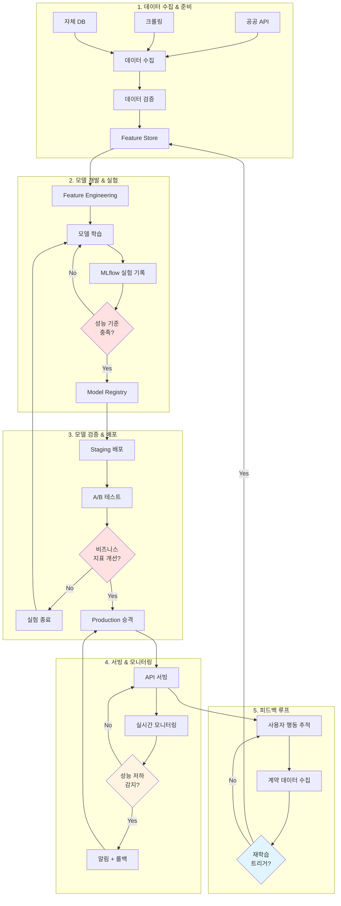

### 1.2 핵심 포인트

**🔁 자동 피드백 루프**
- 계약 데이터가 다시 학습 데이터로 → 모델이 자동으로 진화
- 사람의 개입 최소화 → 확장 가능

**⚡ 빠른 실패, 빠른 복구**
- 각 단계에 검증 게이트
- 문제 발생 시 즉시 롤백

**📊 데이터 중심**
- 모델보다 데이터 품질이 우선
- Feature Store로 일관성 보장

---

## 2. 상세 단계별 흐름

### 2.1 Phase 1: 데이터 수집 (Daily)

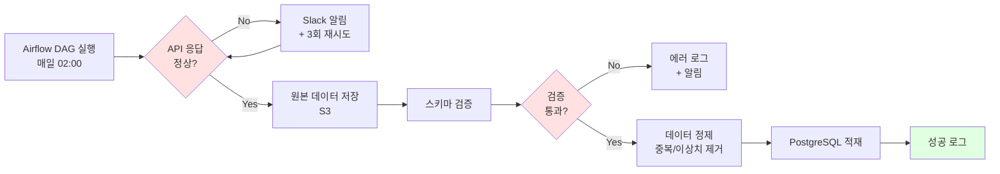

**입력**:
- 국토부 실거래가 API
- 네이버/다음 부동산 크롤링 데이터
- 자체 DB 매물 정보

**출력**:
- 원본 데이터: `s3://raw-data/YYYY-MM-DD/`
- 정제 데이터: PostgreSQL `properties` 테이블

**검증 조건**:
```python
# 스키마 검증
assert 'address' in df.columns
assert 'price' in df.columns

# 범위 검증
assert df['price'].between(1000, 500000).all()  # 1천만~50억

# 분포 검증
assert abs(df['price'].mean() - historical_mean) < 0.2 * historical_mean
```

**소요 시간**: 30분

---

### 2.2 Phase 2: Feature Engineering (Daily)

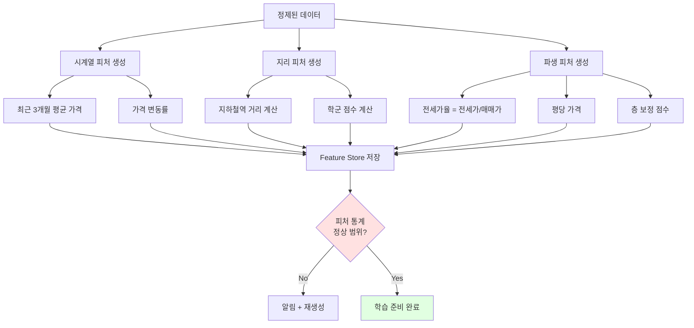

**입력**:
- `properties` 테이블
- 외부 데이터 (지하철역 좌표, 학군 정보)

**출력**:
- `features` 테이블
- 피처 명세서 (자동 생성)

**핵심 피처**:
```python
features = [
    'area_sqm',           # 면적
    'floor',              # 층
    'avg_price_3m',       # 최근 3개월 평균가
    'price_change_pct',   # 가격 변동률
    'subway_distance_m',  # 지하철 거리
    'school_score',       # 학군 점수
    'jeonse_ratio',       # 전세가율
    'price_per_pyeong',   # 평당 가격
    'floor_penalty',      # 층 보정
]
```

**소요 시간**: 20분

---

### 2.3 Phase 3: 모델 학습 (Weekly)

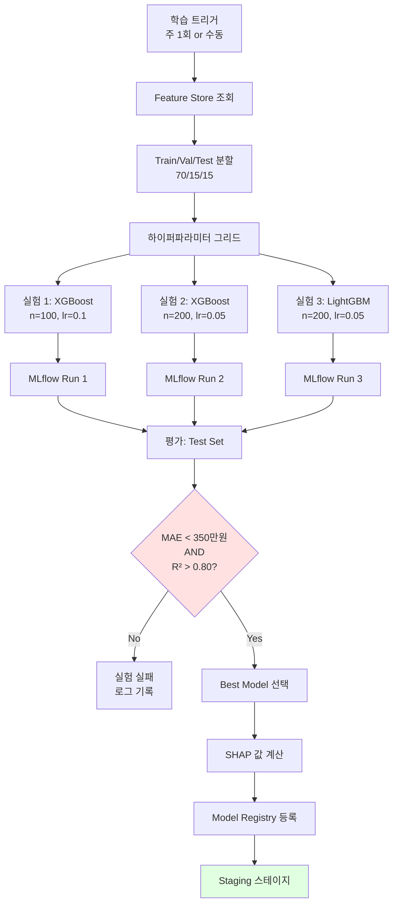

**MLflow 로깅 내용**:
```python
with mlflow.start_run():
    # 1. 파라미터
    mlflow.log_params({
        'n_estimators': 200,
        'learning_rate': 0.05,
        'max_depth': 5,
    })
    
    # 2. 메트릭
    mlflow.log_metrics({
        'mae': 320,
        'rmse': 480,
        'r2': 0.83,
    })
    
    # 3. 아티팩트
    mlflow.log_artifact('feature_importance.png')
    mlflow.log_artifact('shap_summary.png')
    
    # 4. 모델
    mlflow.sklearn.log_model(model, 'model')
```

**소요 시간**: 30분 (3개 실험 병렬 실행)

---

### 2.4 Phase 4: A/B 테스트 (1-2주)

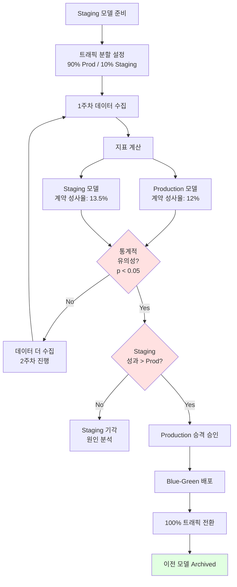

**측정 지표**:
```python
metrics = {
    'primary': {
        'contract_rate': '계약 성사율',  # 주요 지표
    },
    'secondary': {
        'ctr': '클릭율',
        'inquiry_rate': '문의율',
        'avg_contract_amount': '평균 계약 금액',
    }
}
```

**통계 검정**:
```python
from scipy.stats import ttest_ind

control_conversions = [0, 1, 0, 1, 1, ...]  # Production
treatment_conversions = [0, 1, 1, 1, 1, ...]  # Staging

t_stat, p_value = ttest_ind(control_conversions, treatment_conversions)

if p_value < 0.05:
    print("통계적으로 유의미한 차이 있음")
```

**소요 시간**: 1-2주 (트래픽에 따라)

---

### 2.5 Phase 5: 배포 (10분)

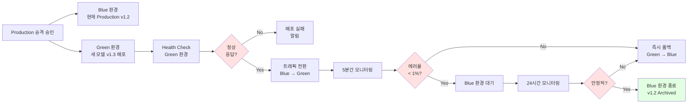

**배포 체크리스트**:
```yaml
pre_deployment:
  - [ ] MLflow에 모델 등록 확인
  - [ ] A/B 테스트 통계적 유의성 확인
  - [ ] 배포 승인 문서 작성
  - [ ] 롤백 계획 수립

deployment:
  - [ ] Green 환경에 새 모델 배포
  - [ ] Health check 통과
  - [ ] 트래픽 1% 라우팅 (smoke test)
  - [ ] 트래픽 100% 전환

post_deployment:
  - [ ] 에러율 모니터링 (< 1%)
  - [ ] 응답 시간 모니터링 (< 500ms)
  - [ ] 비즈니스 지표 추적
  - [ ] 24시간 안정화 확인
```

**소요 시간**: 10분 (자동화)

---

### 2.6 Phase 6: 모니터링 & 피드백 (실시간)

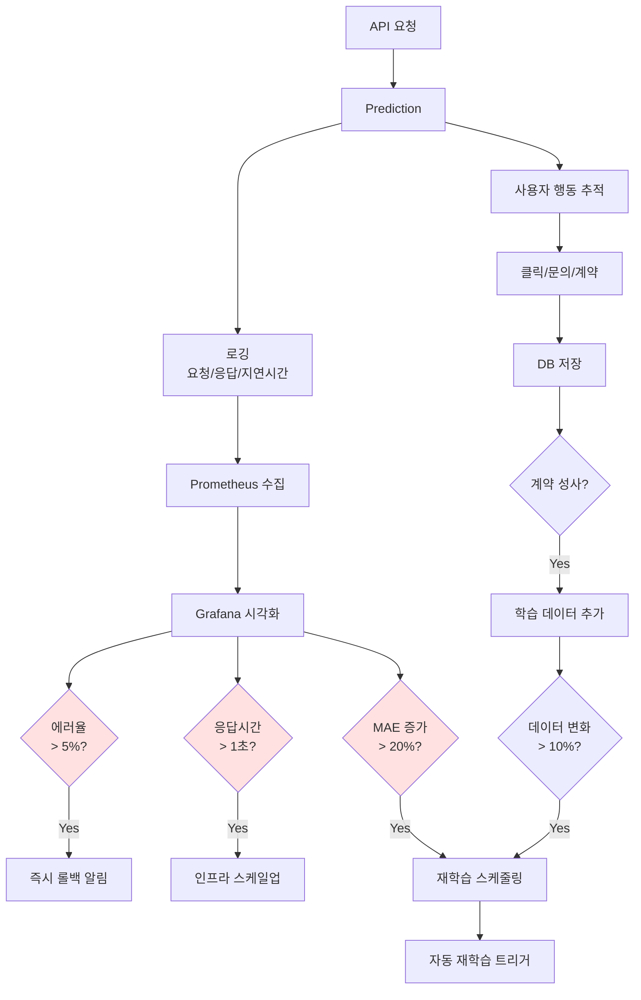

**모니터링 대시보드**:
```
📊 실시간 메트릭
━━━━━━━━━━━━━━━━━━━━━━━━
API 응답 시간 (P95):    245ms ✅
에러율:                0.3% ✅
예측 지연 시간:         12ms ✅

📈 모델 성능
━━━━━━━━━━━━━━━━━━━━━━━━
MAE (최근 7일):         320만원 ✅
예측 정확도:            83% ✅
데이터 드리프트 점수:    0.12 ✅

💼 비즈니스 지표
━━━━━━━━━━━━━━━━━━━━━━━━
일일 예측 수:           2,450건
계약 성사율:            13.2% ✅
평균 계약 금액:         4.2억원
```

---

## 3. 의사결정 트리

### 3.1 모델 승격 결정 플로우

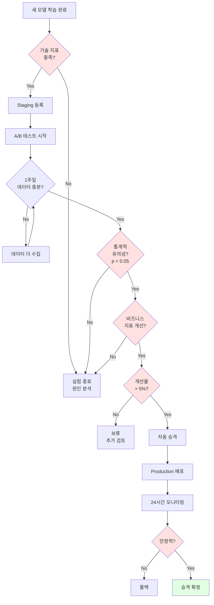

---

## 4. 실패 시나리오 및 복구

### 4.1 데이터 수집 실패

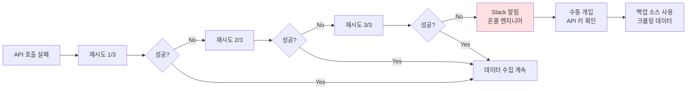

**복구 시간**: 2시간 (수동 개입)

---

### 4.2 모델 성능 저하

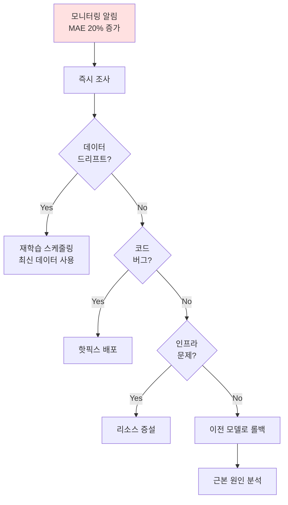

**복구 시간**: 30분 (자동 롤백)

---

### 4.3 배포 실패

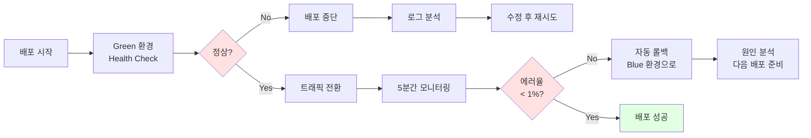

**복구 시간**: 즉시 (자동 롤백)

---

## 5. 타임라인 및 SLA

### 5.1 전체 파이프라인 타임라인

```
Day 1 (월요일)
02:00 ├─ 데이터 수집 시작
02:30 ├─ Feature Engineering
03:00 ├─ 데이터 준비 완료
      │
09:00 ├─ 주간 모델 학습 트리거
09:30 ├─ 3개 실험 병렬 실행
10:00 ├─ Best Model 선택
10:15 ├─ Staging 등록
      │
Day 2-8 (화~월)
      ├─ A/B 테스트 진행 (10% 트래픽)
      ├─ 데이터 수집 중
      │
Day 9 (화요일)
10:00 ├─ A/B 테스트 분석
10:30 ├─ 통계적 유의성 확인
11:00 ├─ Production 승격 결정
11:10 ├─ Blue-Green 배포
11:20 ├─ 배포 완료 ✅
      │
Day 9-10
      ├─ 24시간 안정화 모니터링
      │
Day 10
11:20 ├─ 이전 모델 Archived
      └─ 사이클 완료
```

### 5.2 SLA (Service Level Agreement)

| 지표 | 목표 | 알림 임계값 | 조치 |
|------|------|-------------|------|
| **API 응답 시간 (P95)** | < 500ms | > 800ms | 인프라 스케일업 |
| **API 에러율** | < 1% | > 3% | 즉시 롤백 |
| **예측 정확도 (MAE)** | < 350만원 | > 420만원 | 재학습 스케줄 |
| **데이터 수집 성공률** | > 95% | < 90% | 백업 소스 사용 |
| **모델 학습 시간** | < 1시간 | > 2시간 | 리소스 증설 검토 |
| **배포 다운타임** | 0초 | > 0초 | 롤백 + 프로세스 검토 |
| **A/B 테스트 기간** | 1-2주 | > 3주 | 트래픽 증가 필요 |

### 5.3 온콜 대응 프로토콜

```
📱 알림 우선순위
━━━━━━━━━━━━━━━━━━━━━━━━
P0 (Critical): 즉시 대응 (15분 내)
- API 완전 다운
- 에러율 > 10%
- 데이터 유실

P1 (High): 30분 내 대응
- 에러율 3-10%
- 응답 시간 > 1초
- 배포 실패

P2 (Medium): 2시간 내 대응
- MAE 20% 증가
- 데이터 수집 실패
- 디스크 사용률 > 80%

P3 (Low): 영업일 내 대응
- 성능 최적화 권장
- 리팩토링 필요
```

---

## 6. 핵심 원칙 요약

### 6.1 설계 철학

> **"자동화할 수 있는 것은 모두 자동화하되, 중요한 의사결정은 투명하게"**

1. **자동화 우선**
   - 데이터 수집 → 자동
   - Feature Engineering → 자동
   - 모델 학습 → 자동
   - A/B 테스트 → 자동
   - 배포 → 반자동 (승인 필요)

2. **빠른 실패, 빠른 복구**
   - 각 단계에 검증 게이트
   - 문제 감지 시 즉시 알림
   - 자동 롤백 메커니즘

3. **데이터 중심**
   - 모델보다 데이터 품질 우선
   - Feature Store로 일관성 보장
   - 피드백 루프로 지속 개선

4. **투명성**
   - 모든 실험 MLflow에 기록
   - 의사결정 기준 명확화
   - 성능 지표 실시간 공개

### 6.2 성공 지표

```
✅ 배포 빈도: 주 1회 → 월 4회
✅ 배포 성공률: > 95%
✅ 롤백 시간: < 5분
✅ 모델 성능: MAE < 350만원
✅ API 가용성: > 99.9%
✅ 자동화율: > 80%
```

---

## 7. 다음 단계

이 흐름도를 바탕으로:

1. ✅ **코드 구현**: 각 단계의 실제 코드 작성
2. **자동화 강화**: CI/CD 파이프라인 구축
3. **모니터링 고도화**: 더 세밀한 메트릭 수집
4. **확장**: 멀티 모델, 멀티 지역 지원

---

**문서 버전**: v1.0  
**최종 수정**: 2026.02.06  
**다음 업데이트**: 실제 운영 데이터 기반 타임라인 조정
