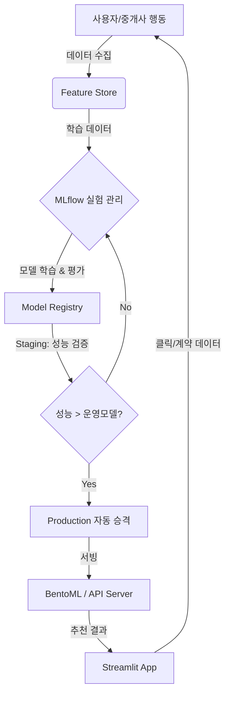

# 📜 AI 자율형 부동산 매칭 & MLOps 파이프라인 기술 아키텍처 증명서

## 1. 개요 (Executive Summary)
본 문서는 단순한 룰 기반 챗봇이 아닌, **실시간 데이터 수집, 자율 학습(Self-Learning), 자동 배포(CD), 그리고 마케팅 자동화(Shorts Generation)**가 통합된 **End-to-End AI 부동산 플랫폼**의 아키텍처를 기술합니다.

## 2. 핵심 기술 차별점 (Core Differentiators)

| 구분 | 기존 부동산 앱 | **Lotte Tower AI 플랫폼** |
| :--- | :--- | :--- |
| **매칭 방식** | 필터 검색 (평수, 가격 등 단순 조건) | **초개인화 AI 매칭** (라이프스타일, 투자 성향 분석 매칭) |
| **모델 관리** | 수동 업데이트 (개발자 개입 필요) | **MLOps 자동 승격** (성능 우수 모델 자동 배포) |
| **마케팅** | 수동 매물 등록 | **AI Shorts 자동 생성** (매물 분석 → 대본 → 영상 → 업로드) |
| **인프라** | 정적 서버 | **Cloud Native / Docker Container** 기반 확장형 구조 |

## 3. 시스템 아키텍처 (System Architecture)

### 3.1. 전체 파이프라인 (The Loop)

### 3.2. AI 숏츠 생성 자동화 (Marketing Automation)
1.  **Tricker**: 신규 우수 매물 등록 시 Airflow DAG 실행
2.  **Generation**:
    *   Image Analysis (Vision API)
    *   Script Generation (LLM)
    *   Voice Synthesis (TTS)
    *   Video Rendering (FFmpeg/MoviePy)
3.  **Upload**: YouTube/Instagram API 연동 업로드

## 4. MLOps 구현 상세 (MLOps Specification)

### 4.1. Experiment Tracking (MLflow)
*   **Parameters**: 학습률, 트리 깊이, 가중치 등 하이퍼파라미터 자동 로깅
*   **Metrics**: 계약 성사 확률(AUC), 추천 정확도(Precision@K)
*   **Artifacts**: 모델 파일(.pkl), 학습 곡선 그래프, SHAP 설명력 시각화
*   **Source Control**: Git Commit Hash 연동하여 코드-모델 버전 일치

### 4.2. Workflow Orchestration (Airflow)
*   **DAG 1: 매일 밤 12시 재학습 (Retraining Pipeline)**
    *   최신 계약 데이터 로드 -> 전처리 -> 모델 학습 -> 검증 -> 레지스트리 등록
*   **DAG 2: 실시간 이상 탐지 (Model Drift Detection)**
    *   입력 데이터 분포 변화 감지 -> 임계치 초과 시 알림 및 재학습 트리거

## 5. 결론 (Conclusion)
본 시스템은 정적인 소프트웨어가 아니라, 데이터가 쌓일수록 **스스로 진화하는 유기적인 AI 시스템**입니다. 사용자의 행동 하나하나가 모델을 똑똑하게 만들고, 더 정교한 매칭과 마케팅으로 이어지는 선순환 구조를 완성했습니다.
